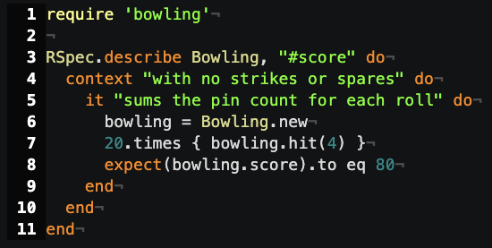
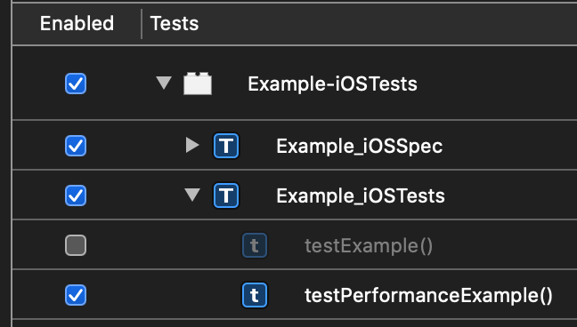
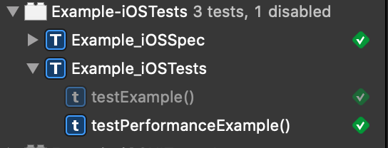

<!-- slidenumbers: true -->
<!-- footer: @phatblat - [Unit Testing with Quick](https://github.com/phatblat/UnitTestingWithQuick) -->

# Unit Testing with [Quick](https://github.com/Quick/Quick)

Presented at [Cocoaheads Denver](https://www.meetup.com/CocoaheadsDenver/)
on Tuesday 2020-03-10 at Galvanize

---

# Slides & Example Project

[phatblat/UnitTestingWithQuick](https://github.com/phatblat/UnitTestingWithQuick)

---

# Quick & Nimble

Open Source

- Quick/[Quick](https://github.com/Quick/Quick)
  - Used to define examples.
- Quick/[Nimble](https://github.com/Quick/Nimble)
  - Matcher framework used to express expectations.

^ Core contributor
^ BDD style framework

---

# BDD

- _Behavior-Driven Development_
- Don't test code
- Verify behavior
- Semi-formal format for behavior specification
- Similar to user story
- Object-oriented design

^ Semi-formal format for behavioral specification which is borrowed from user story specifications from the field of object-oriented analysis and design.
^ Not full Gherkin syntax
^ Scenario, Given, When, Then

---

# RSpec

- Behaviour Driven Development for Ruby.
- "Making TDD Productive and Fun."



---

# QuickSpec

```swift

class TableOfContentsSpec: QuickSpec {
  override func spec() {
    describe("the 'Documentation' directory") {
      it("has everything you need to get started") {
        let sections = Directory("Documentation").sections
        expect(sections).to(contain("Organized Tests with Quick Examples and Example Groups"))
        expect(sections).to(contain("Installing Quick"))
      }

      context("if it doesn't have what you're looking for") {
        it("needs to be updated") {
          let you = You(awesome: true)
          expect{you.submittedAnIssue}.toEventually(beTruthy())
        }
      }
    }
  }
}
```

---

# `describe`

```swift
describe("the thing") { /* closure */ }
```

- Describes the thing being tested.
- Groups examples.
- Serves as a prefix for the actual test name.

---

# `it`

```swift
it("calculates an average score") { /* closure */ }
```

- Describes an example behavior.
- Contains assertions (expectations).
- _One expectation per example._

---

# `context`

```swift
context("when dark mode is enabled") { /* closure */ }
```

- Optional alternate 2nd-Nth level of grouping for examples.
- Arbitrary nesting. 🎎

—--

# Disabled Test (Quick)

```swift
xit("this example is disabled") { code.compiles() == yes }
```

- Prefix any example with `x` to disable.
- `xit`

^ I don't recommend commenting out tests because code won't compile
^ If you don't want it to compile, delete it

—--

# Disabled Test (Xcode)

- Must edit scheme to disable tests.
- Shows test method as disabled.

Scheme > Test action|Test Navigator
---|---

 

^ Test configuration separate from tests.
^ Had CI not honor test configuration in scheme.

—--

# ✨ Disabled Test Suite

```swift
xdescribe("the thing") {
xcontext("when dark mode is enabled") {
xit("this example is disabled") { code.compiles() == yes }
```

- Prefix any Quick function(s) with `x` to disable everything under that scope.
- Any combination of disabled examples is skipped.

—--

# ✨ Focused Test

```swift
fit("is focused") { expect(example).toRun(true) }
it("will be ignored") { code.compiles() == yes }
```

- Prefix any example with `f` to focus.
- Only the focused example(s) will be run.

—--

# ✨ Focused Test Suites


```swift
fdescribe("the thing") {
fcontext("when dark mode is enabled") {
fit("is focused") { expect(example).toRun(true) }
```

- Prefix any Quick function(s) with `f` to focus everything under that scope.
- Only the focused example(s) will be run.
- All focused examples will be run.

---

# Quick Caveats

- Easy to forget disabled/focused tests.
- Clicking on Quick example in Test Navigator doesn't navigate to code.

—--

# Xcode UI

---

# Test Name

—--

# Type Handling

—--

# Nimble

- Matcher framework
- Swift and Objective-C

```swift
expect(1 + 1).to(equal(2))
expect(1.2).to(beCloseTo(1.1, within: 0.1))
expect(3) > 2
expect("seahorse").to(contain("sea"))
expect(["Atlantic", "Pacific"]).toNot(contain("Mississippi"))
```


---

# Custom Failure Message

```swift
expect(1 + 1).to(equal(3))
// failed - expected to equal <3>, got <2>

expect(1 + 1).to(equal(3), description: "Make sure libKindergartenMath is loaded")
// failed - Make sure libKindergartenMath is loaded
// expected to equal <3>, got <2>
```

—--

# Async Test

```swift
expect(ocean.isClean).toEventually(beTruthy())
```

—--

# Custom Matcher

---

# Closures

## Properties

## Local Variables

---

# iOS Examples

---

# macOS Examples

---

---

> This is an awe-inspiring quote.
> -- Someone Famous

---

# References


- [Unit Testing With Quick](https://github.com/phatblat/UnitTestingWithQuick) - Slides & Code Samples
- [Quick](https://github.com/Quick/Quick)
  - [Quick Docs](https://github.com/Quick/Quick/blob/master/Documentation/en-us/README.md)
- [Nimble](https://github.com/Quick/Nimble)
- Jon Reid
  - [Quality Coding](https://qualitycoding.org/)
  - [iOS Unit Testing By Example](https://pragprog.com/book/jrlegios/ios-unit-testing-by-example) 📕
- [BDD](https://en.wikipedia.org/wiki/Behavior-driven_development)
- Inspirations
  - [RSpec](https://rspec.info/) for Ruby
  - [Specta](https://github.com/specta/specta) for Objective-C
  - [Ginkgo](https://github.com/onsi/ginkgo) for Go
  - [Cedar](https://github.com/pivotal/cedar) for Objective-C
- [Deckset app](https://www.deckset.com/)
