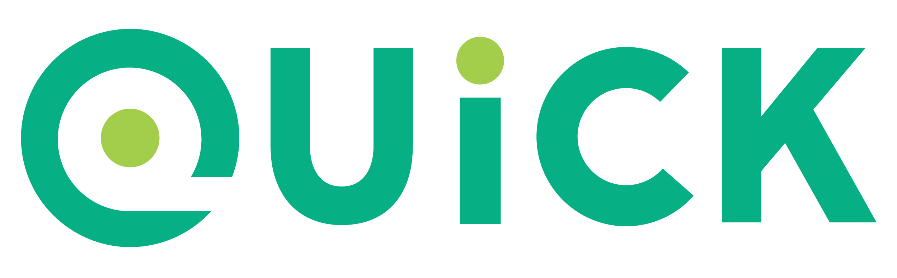
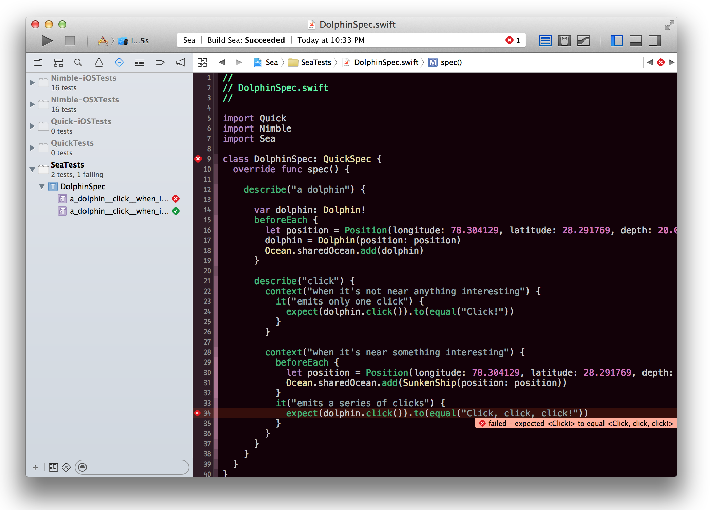
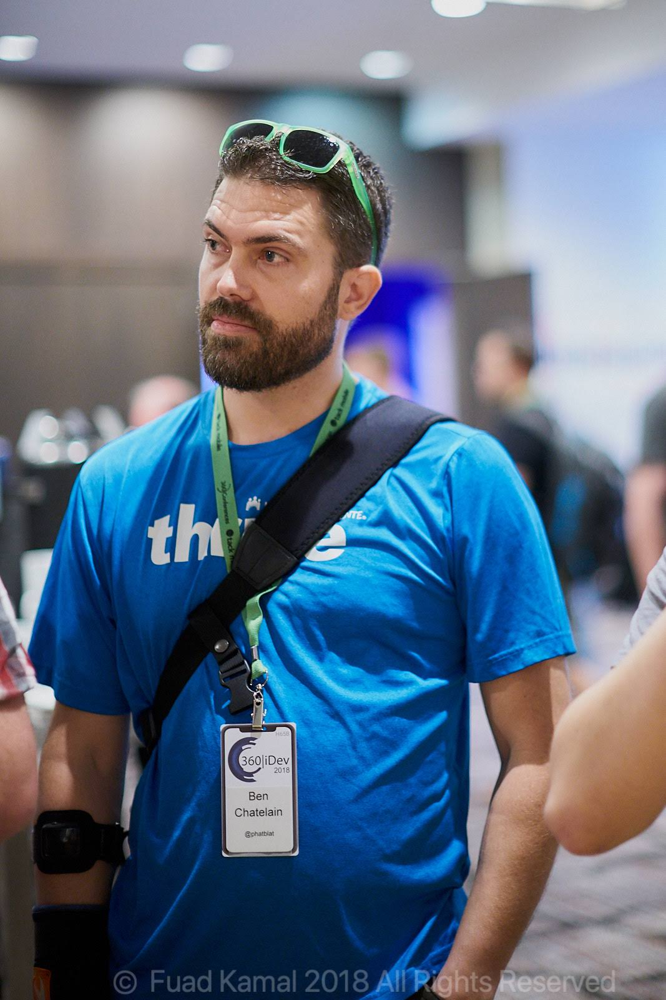
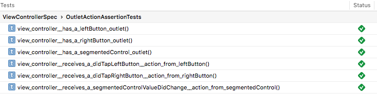

theme: Copy of Titillium
slidenumbers: true
slide-transition: fade(0.3)


> Jack be [nimble](about://blank),
> Jack be [quick](about://blank),
> Jack jump over
> The candlestick.

^
“Jumping over candlesticks” or “Candle-leaping” was traditional in England, mostly practiced in the markets and fairs.
It was believed that it is a good-luck sign to succeed to clear the candle and to not damp down the flame.

---

# Unit Testing with [Quick](https://github.com/Quick/Quick)

Presented at [Cocoaheads Denver](https://www.meetup.com/CocoaheadsDenver/)
2020-03-10 at Galvanize
by @phatblat



---

# Slides & Examples

## [phatblat/UnitTestingWithQuick](https://github.com/phatblat/UnitTestingWithQuick)



---

# @[phatblat](https://twitter.com/phatblat)

- Ben Chatelain
- Chief iOS Engineer
- Kaiser Permanente
- Manage suite of ~30 iOS & Android libs
- open source: Quick, mas, Objective-Git
- indie app dev 2008-2009



---

# Quick & Nimble

Open Source

- Quick/[Quick](https://github.com/Quick/Quick)
  - BDD testing framework, used to define examples.
- Quick/[Nimble](https://github.com/Quick/Nimble)
  - Matcher framework used to express expectations.

^
Quick & Nimble work together
Core contributor
BDD style framework
Both also supports Objective-C

---

# BDD

- _Behavior-Driven Development_
- Don't test code
- Verify behavior
- Semi-formal format for behavior spec
- Similar to user story
- Object-oriented design
- Gherkin: Scenario, Given, When, Then

^
Quick is not full Gherkin syntax

---

# RSpec

- Behaviour Driven Development for Ruby.
- "Making TDD Productive and Fun."


^
BDD-lite

---

# QuickSpec

```swift

class TableOfContentsSpec: QuickSpec {
  override func spec() {
    describe("the 'Documentation' directory") {
      it("has everything you need to get started") {
        let sections = Directory("Documentation").sections
        expect(sections).to(contain("Organized Tests with Quick Examples and Example Groups"))
        expect(sections).to(contain("Installing Quick"))
      }

      context("if it doesn't have what you're looking for") {
        it("needs to be updated") {
          let you = You(awesome: true)
          expect{you.submittedAnIssue}.toEventually(beTruthy())
        }
      }
    }
  }
}
```


---

# `describe`

```swift
describe("the thing") { /* closure */ }
```

- Describes the thing being tested.
- Groups examples.
- Serves as a prefix for the actual test name.
- Analogous to `XCTestCase`

^
Essentially a suite of tests.
_Can_ be nested, but don't.

---

# `context`

```swift
context("when dark mode is enabled") { /* closure */ }
```

- Optional alternate 2nd-Nth level of grouping for examples.
- ✨ Arbitrary nesting. 🎎

---

# `it`

```swift
it("calculates an average score") { /* closure */ }
```

- Describes an example behavior.
- Contains assertions (expectations).
- _One expectation per example._

^
- "one expectation" is my advice, but I feel very strongly about this.
- If more than one expectation, each should probably include custom description.

---

# Setup & Teardown

```swift
var dolphin: Dolphin!
beforeEach { dolphin = Dolphin() }
afterEach { dolphin = nil }
```

- Declares logic to be run before/after each example.
- ✨ Can be placed inside any/every `describe` and `context`.

---

# ✨ Nesting FTW!

```swift
describe("dolphin") {
  beforeEach { dolphin = Dolphin() }
  context("when out of water") {
    beforeEach { dolphin.airborne = true }
    context("and making noise") {
      beforeEach { dolphin.vocalizationLevel = 5 }
      it("is loud") { /* closure */ }
      it("can be heard from 100m away") { /* closure */ }
```

---

# Suite Setup & Teardown

```swift
override func spec() {
  beforeSuite {
    OceanDatabase.createDatabase(name: "test.db")
    OceanDatabase.connectToDatabase(name: "test.db")
  }
  afterSuite {
    OceanDatabase.teardownDatabase(name: "test.db")
  }
  describe("a dolphin") {}
```

^
- All beforeSuite/afterSuite closures will be executed before/after all tests are run/finished.
- spec method is context?
- No guarantee of ordering for closures execution.

—--

# Disabled Test (Quick)

```swift
xit("this example is disabled") { code.compiles() == yes }
```

- Prefix any example with `x` to disable.
- `xit`

^
- Intended to be temporary.
- Don't forget to undo focus before commit.
- I don't recommend commenting out tests because code won't compile.
- If you don't want it to compile, delete it.

—--

# Disabled Test (Xcode)

- Must edit scheme to disable tests.
- Shows test method as disabled.

| Scheme > Test action | Test Navigator
| --- | ---

 

^
- Test configuration separate from tests.
- Had CI not honor test configuration in scheme.

—--

# ✨ Disabled Test Suite

```swift
xdescribe("the thing") {
xcontext("when dark mode is enabled") {
xit("this example is disabled") { code.compiles() == yes }
```

- Prefix any Quick function(s) with `x` to disable everything under that scope.
- Any combination of disabled examples will be skipped.

—--

# ✨ Focused Test

```swift
fit("is focused") { expect(example).toRun(true) }
it("will be ignored") { code.compiles() == yes }
```

- Prefix any example with `f` to focus.
- Only the focused example(s) will be run.

—--

# ✨ Focused Test Suites

```swift
fdescribe("the thing") {
fcontext("when dark mode is enabled") {
fit("is focused") { expect(example).toRun(true) }
```

- Prefix any Quick function(s) with `f` to focus everything under that scope.
- Only the focused example(s) will be run.
- All focused examples will be run.

^
- Intended to be temporary.
- Don't forget to undo focus before commit.

---

[.autoscale: false]

# Test Readability

XCTest

```swift
func testDolphin_click_whenTheDolphinIsNearSomethingInteresting_isEmittedThreeTimes() {
  // ...
}
```

Quick

```swift
describe("a dolphin") {
  describe("its click") {
    context("when the dolphin is near something interesting") {
      it("is emitted three times") {
        // ...
      }
    }
  }
}
```

^
- XCTest name is good practice
- still constrained to allowed symbols for method name
- strings more readable with spaces

---

# ✨ Quick Test Names


---

# ✨ More Test Names



Names are automatically built from describe/context/it descriptions

^
Obviates need for failure descriptions

---

# Don't Use Properties

```swift

class TableOfContentsSpec: QuickSpec {
  var dolphin: Dolphin!
  override func spec() {
    describe("dolphin") {
      beforeEach { self.dolphin = Dolphin() }
```

^
- Reference to property 'dolphin' in closure requires explicit 'self.' to make capture semantics explicit

---

# Use Local Variables

```swift

class TableOfContentsSpec: QuickSpec {
  override func spec() {
    var dolphin: Dolphin!
    describe("dolphin") {
      beforeEach { dolphin = Dolphin() }
```

^
- style: Use ! liberally in tests
- there should be only one happy path through the test

—--

# Nimble

- Matcher framework
- Swift and Objective-C

```swift
expect(1 + 1).to(equal(2))
expect(1.2).to(beCloseTo(1.1, within: 0.1))
expect(3) > 2
expect("seahorse").to(contain("sea"))
expect(["Atlantic", "Pacific"]).toNot(contain("Mississippi"))
```

—--

# Type Safety

Nimble

```swift
it("does not compile") {
  expect(1 + 1).to(equal("Squee!"))
  // Cannot convert value of type 'Int' to expected argument type 'String?'
```

XCTest

```swift
func testComparingDifferentTypes() throws {
  XCTAssertEqual("Squee!", 1 + 1)
  // Cannot convert value of type 'String' to expected argument type 'Int'
```

^
- XCTest arguments are 

---

# Custom Failure Message

Nimble

```swift
expect(1 + 1).to(equal(3))
// failed - expected to equal <3>, got <2>

expect(1 + 1).to(equal(3), description: "Make sure libKindergartenMath is loaded")
// failed - Make sure libKindergartenMath is loaded
// expected to equal <3>, got <2>
```

XCTest

```swift
XCTAssertEqual(1 + 1, 3, "Make sure libKindergartenMath is loaded")
// XCTAssertEqual failed: ("2") is not equal to ("3") - Make sure libKindergartenMath is loaded
```

^
- Don't use `description:` as quick example names are good enough.
- Especially if you only have one `expect` per example.

—--

# Async Test

```swift
expect(ocean.isClean).toEventually(beTruthy())
```

—--

# ✨ Custom Matcher

```swift
expect(result).to(beFailure { error in
  expect(error) == .searchFailed
})

func beFailure(test: @escaping (MASError) -> Void = { _ in }) -> Predicate<Result<(), MASError>> {
  return Predicate.define("be <failure>") { expression, message in
    if let actual = try expression.evaluate(),
      case let .failure(error) = actual {
        test(error)
          return PredicateResult(status: .matches, message: message)
      }
      return PredicateResult(status: .fail, message: message)
  }
}
```

---

# Quick Caveats

- Easy to forget disabled/focused tests.
- Clicking on Quick example in Test Navigator doesn't navigate to code.
- Quick tests don't display in Test Navigator until tests have been run.
- No support for performance tests.
- External dependency.

^
- New tests/examples also won't display until you run tests again.
- Once tests have been discovered, green/red annotations will show in Xcode editor.
- Quick and XCTest can be mixed in a project.

---

# iOS Examples

---

# macOS Examples

---

---

> Tests that take too long to run end up not being run.
> -- [Michael Feathers](https://www.goodreads.com/author/quotes/25201.Michael_C_Feathers)

---

# References


- [Unit Testing With Quick](https://github.com/phatblat/UnitTestingWithQuick) - Slides & Code Samples
- [Quick](https://github.com/Quick/Quick)
  - [Quick Docs](https://github.com/Quick/Quick/blob/master/Documentation/en-us/README.md)
- [Nimble](https://github.com/Quick/Nimble)
- Jon Reid
  - [Quality Coding](https://qualitycoding.org/)
  - [iOS Unit Testing By Example](https://pragprog.com/book/jrlegios/ios-unit-testing-by-example) 📕
- [BDD](https://en.wikipedia.org/wiki/Behavior-driven_development)
- Inspirations
  - [RSpec](https://rspec.info/) for Ruby
  - [Specta](https://github.com/specta/specta) for Objective-C
  - [Ginkgo](https://github.com/onsi/ginkgo) for Go
  - [Cedar](https://github.com/pivotal/cedar) for Objective-C
- [Deckset app](https://www.deckset.com/)
